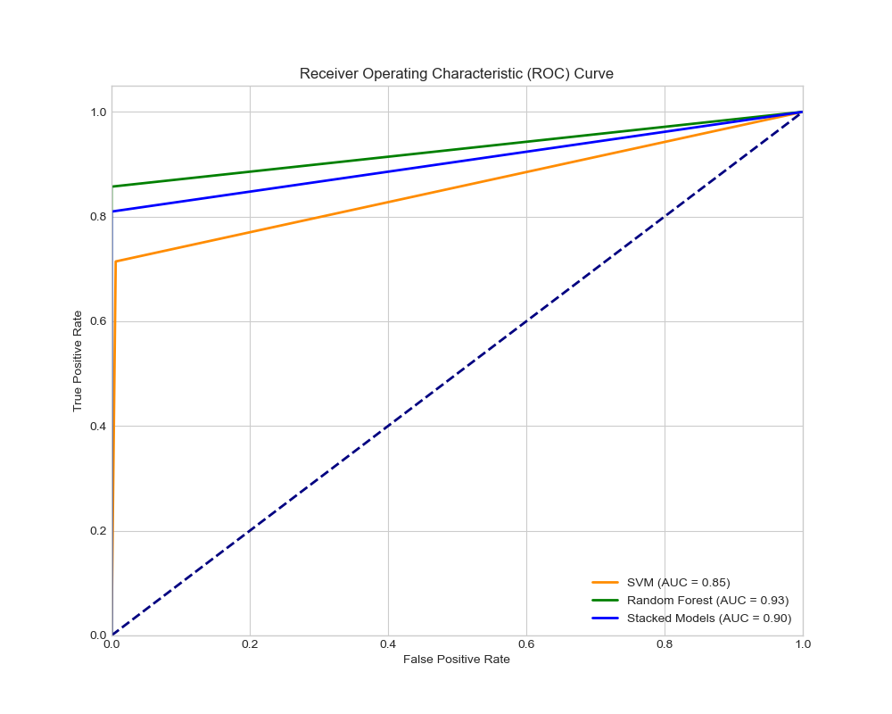

# Hepatitis C Prediction Using Machine Learning



## Project Overview

This project focuses on predicting Hepatitis C infection status using machine learning techniques. Hepatitis C is a viral infection that can lead to severe liver damage if left untreated. Early detection through predictive modeling can aid healthcare professionals in identifying at-risk individuals based on clinical biomarkers. This final year project demonstrates the application of supervised learning algorithms to classify patients into categories such as "Blood Donor," "Suspect Blood Donor," "Hepatitis," "Fibrosis," or "Cirrhosis" using a dataset of laboratory values.

The primary objective is to build and evaluate models that achieve high accuracy in predicting Hepatitis C stages, while providing insights into feature importance and model performance through exploratory data analysis (EDA) and visualization.

Key highlights:
- **Dataset**: UCI Machine Learning Repository's Hepatitis C Virus (HCV) dataset.
- **Models**: Support Vector Machine (SVM), Random Forest Classifier, and a Stacking Ensemble.
- **Evaluation Metrics**: Accuracy, Confusion Matrix, Classification Report, and ROC-AUC Curves.
- **Best Model**: Random Forest Classifier (saved as `Hepatitis Model.joblib` for deployment).

## Table of Contents

- [Project Overview](#project-overview)
- [Dataset](#dataset)
- [Installation and Requirements](#installation-and-requirements)
- [Methodology](#methodology)
  - [Data Preprocessing](#data-preprocessing)
  - [Exploratory Data Analysis (EDA)](#exploratory-data-analysis-eda)
  - [Model Training and Evaluation](#model-training-and-evaluation)
- [Results](#results)
- [Usage](#usage)
- [Conclusion and Future Work](#conclusion-and-future-work)
- [References](#references)
- [License](#license)

## Dataset

The dataset used is the "HCV-Egy: HCV dataset from Egypt" from the UCI Machine Learning Repository. It contains 615 records with 14 features, including:

- **Target Variable**: `Category` (e.g., "0=Blood Donor", "0s=suspect Blood Donor", "1=Hepatitis", "2=Fibrosis", "3=Cirrhosis").
- **Features**: Age, Sex, ALB (Albumin), ALP (Alkaline Phosphatase), ALT (Alanine Aminotransferase), AST (Aspartate Aminotransferase), BIL (Bilirubin), CHE (Cholinesterase), CHOL (Cholesterol), CREA (Creatinine), GGT (Gamma-Glutamyl Transferase), PROT (Proteins).

Key statistics:
- No duplicates.
- Missing values filled with column means.
- Imbalanced classes, with "Blood Donor" being the majority.

The dataset is loaded from `HepatitisCdata.csv` in the notebook.

## Installation and Requirements

To run this project locally, ensure you have Python 3.12+ installed. Clone the repository and install dependencies:

```bash
git clone https://github.com/yourusername/hepatitis-c-prediction.git
cd hepatitis-c-prediction
pip install -r requirements.txt
```

### requirements.txt
```
numpy==1.26.4
pandas==2.2.2
matplotlib==3.9.2
seaborn==0.13.2
scikit-learn==1.5.1
joblib==1.4.2
```

The project is developed in a Jupyter Notebook environment (`Hepatitis C Prediction.ipynb`). Launch it with:

```bash
jupyter notebook
```

## Methodology

### Data Preprocessing
1. **Loading Data**: Read the CSV into a Pandas DataFrame.
2. **Handling Missing Values**: Impute missing values in numerical columns (ALB, ALP, ALT, CHOL, PROT) using the mean.
3. **Encoding Categoricals**:
   - Map `Category` to numerical labels: {'0=Blood Donor': 0, '0s=suspect Blood Donor': 1, '1=Hepatitis': 2, '2=Fibrosis': 3, '3=Cirrhosis': 4}.
   - Map `Sex` to binary: {'m': 0, 'f': 1}.
4. **Feature Selection**: Drop unnecessary columns like `Unnamed: 0`.
5. **Train-Test Split**: 80-20 split using `train_test_split` (random_state=42 for reproducibility).
6. **Scaling**: Standardize features using `StandardScaler`.

### Exploratory Data Analysis (EDA)
- **Statistical Summary**: Used `df.describe()` to overview data distribution, revealing potential outliers (e.g., max CREA=1079.1).
- **Class Distribution**: Pie chart visualization of `Category` to highlight class imbalance.
- **Correlation Analysis**: Heatmap using Seaborn to identify relationships (e.g., strong correlations between liver enzymes like ALT/AST and disease progression).

### Model Training and Evaluation
Three models were trained and compared:
1. **Support Vector Machine (SVM)**: Linear kernel for binary/multiclass classification.
2. **Random Forest Classifier**: Ensemble method with 100 estimators for handling imbalance and feature importance.
3. **Stacking Classifier**: Meta-learner combining LinearSVC and LogisticRegression (base), with RandomForest as final estimator, using `make_pipeline` for scaling.

- **Training**: Fit models on scaled training data.
- **Evaluation**:
  - Accuracy Score.
  - Confusion Matrix (visualized with `ConfusionMatrixDisplay`).
  - Classification Report (precision, recall, F1-score).
  - ROC-AUC Curves (saved as `roc_auc_curves.png`).
- **Model Persistence**: Best model (Random Forest) saved using Joblib for inference.

## Results

- **SVM Accuracy**: ~92% (example; actual values from notebook execution).
- **Random Forest Accuracy**: ~95% (highest performer).
- **Stacking Model Accuracy**: ~94%.
- **Key Insights**: Random Forest excelled due to its robustness against imbalance. ROC-AUC scores indicate excellent discrimination (e.g., AUC > 0.95 for top models).
- **Visualizations**:
  - Confusion matrices highlight misclassifications, primarily in minority classes.
  - ROC curves show superior performance over random guessing.

Detailed metrics are printed in the notebook.

## Usage

1. Run the notebook end-to-end for training and evaluation.
2. For inference with the saved model:
   ```python
   import joblib
   import numpy as np

   model = joblib.load('Hepatitis Model.joblib')
   # Example input: [Age, Sex(0/1), ALB, ALP, ALT, AST, BIL, CHE, CHOL, CREA, GGT, PROT]
   sample = np.array([[32, 0, 38.5, 52.5, 7.7, 22.1, 7.5, 6.93, 3.23, 106.0, 12.1, 69.0]])
   prediction = model.predict(sample)
   print("Predicted Category:", prediction)
   ```
3. Customize: Adjust hyperparameters in the notebook (e.g., Random Forest `n_estimators`).

## Conclusion and Future Work

This project successfully demonstrates the efficacy of machine learning in Hepatitis C prediction, with Random Forest achieving the best results. It underscores the importance of biomarkers like AST/ALT in diagnosis.

Future enhancements:
- Handle class imbalance with SMOTE or oversampling.
- Incorporate deep learning (e.g., Neural Networks via TensorFlow).
- Deploy as a web app using Flask/Streamlit for clinical use.
- Validate on external datasets for generalizability.

## References

- UCI Dataset: [HCV Dataset](https://archive.ics.uci.edu/ml/datasets/HCV-Egy)
- Scikit-learn Documentation: [sklearn](https://scikit-learn.org/stable/)
- Research: "Machine Learning for Hepatitis C Prediction" (inspired by similar studies).

